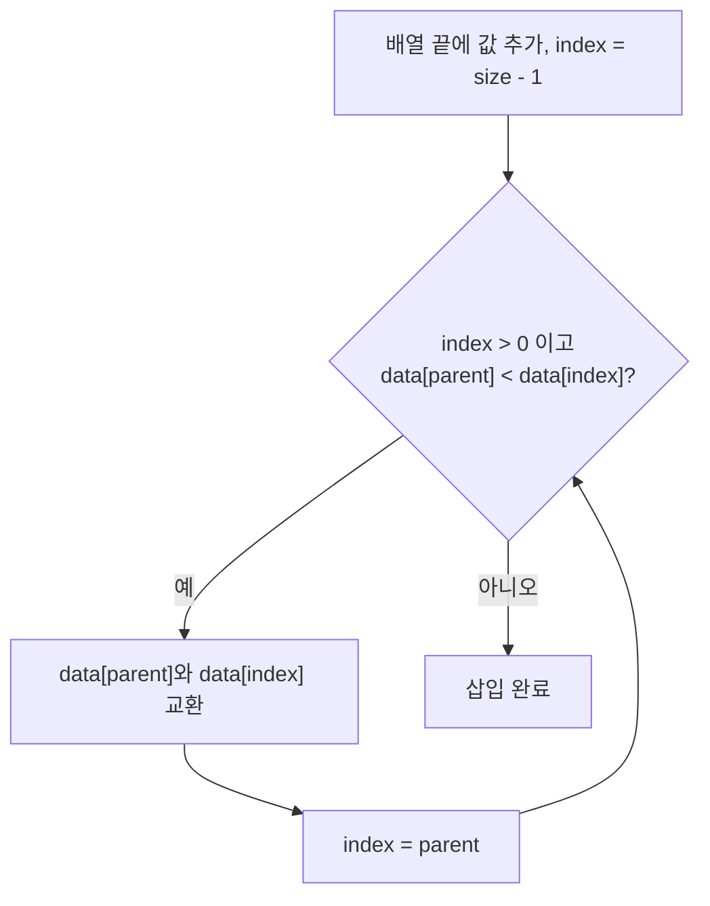
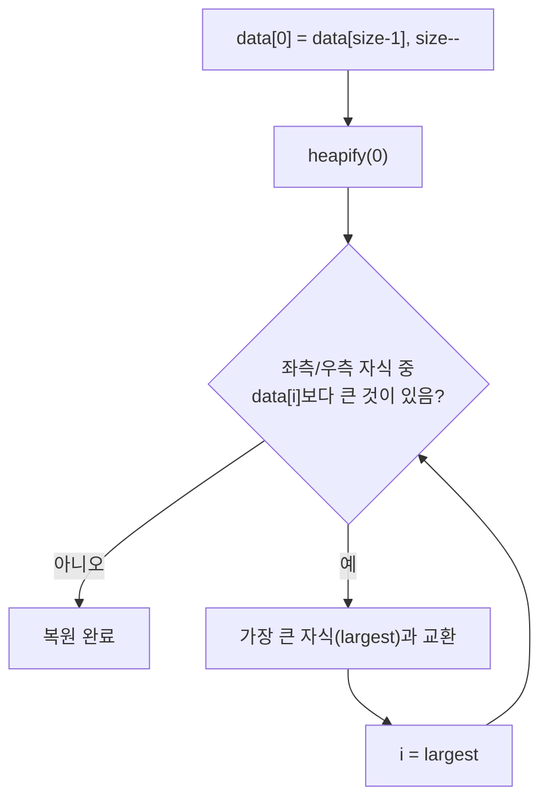

# Development Notes

이 문서는 PriorityQueue 구현을 유지보수하거나 확장할 개발자를 위한 설명서입니다.

---

## 구현 요약

이 저장소는 두 가지 언어로 같은 최대 힙 기반 PriorityQueue를 구현합니다.

| 구현 | 핵심 구조 | 저장소 | 메모리 관리 |
| --- | --- | --- | --- |
| C | `struct priority_queue` | `int *data` (동적 배열) | `malloc/free` |
| C++ | `class priorityqueue` | `int *data` (동적 배열) | `new[]/delete[]`, 복사 금지 |

---

## 메모리 구조

### 배열 기반 완전 이진 트리

힙은 배열 하나로 완전 이진 트리를 표현합니다. 인덱스 `i`의 노드에 대해 다음 관계가 성립합니다.

```
부모:      (i - 1) / 2
좌측 자식:  2 * i + 1
우측 자식:  2 * i + 2
```

예시: `5, 3, 8, 1, 9, 12, 7, 4`를 삽입한 결과

```
              12                   ← index 0
           /       \
         8           9            ← index 1, 2
       /   \       /   \
      4     3     5     7         ← index 3, 4, 5, 6
     /
    1                             ← index 7
```

배열 표현:

```
index:  0   1   2   3   4   5   6   7
data: [12,  8,  9,  4,  3,  5,  7,  1]
```

**`struct priority_queue` / `class priorityqueue` 필드:**

```
+----------+
|  data    |  int* — 힙 원소를 담는 배열
+----------+
|  size    |  int  — 현재 원소 수
+----------+
| capacity |  int  — 최대 원소 수
+----------+
```

---

## 핵심 규칙 (불변식)

코드를 수정할 때 반드시 지켜야 하는 규칙입니다.

1. **모든 노드는 자신의 자식보다 크거나 같다.** (max-heap 속성)
2. 배열의 `[0]`에는 항상 가장 큰 값이 위치한다.
3. 원소는 배열의 `[0]`부터 `[size-1]`까지 빈 공간 없이 채워진다. (완전 이진 트리)
4. `size <= capacity`를 항상 만족한다.
5. `size == 0`이면 큐는 비어 있다.

---

## 인덱스 구조

레벨별 원소 범위는 다음과 같습니다.

```
Level 0:  index 0           (1개,    2^0 개)
Level 1:  index 1 ~ 2       (2개,    2^1 개)
Level 2:  index 3 ~ 6       (4개,    2^2 개)
Level 3:  index 7 ~ 14      (8개,    2^3 개)
...
Level i:  index (2^i - 1) ~ (2^(i+1) - 2)
```

현재 힙의 깊이(depth)는 다음과 같이 구합니다.

```text
depth = -1
while size > 0:
    size /= 2
    depth++
```

size가 1이면 depth = 0, size가 2~3이면 depth = 1, size가 4~7이면 depth = 2입니다.

---

## 삽입 알고리즘 (Sift-Up)

새 원소를 배열 끝에 추가한 뒤, 부모보다 크면 위로 올라가며 자리를 바꿉니다.



의사코드:

```text
data[size] = value
index = size
size++

while index > 0:
    parent = (index - 1) / 2
    if data[parent] >= data[index]:
        break
    swap(data[parent], data[index])
    index = parent
```

링크 연결 순서와 달리, 삽입 시 교환 순서는 자유롭습니다. 부모와 현재 노드를 바꾸는 것이 전부이기 때문입니다.

---

## 제거 알고리즘 (Sift-Down / Heapify)

루트(최댓값)를 꺼낸 뒤, 마지막 원소를 루트로 이동하고 아래로 내려가며 힙 속성을 복원합니다.



`heapify(i)` 의사코드:

```text
largest = i
left  = 2 * i + 1
right = 2 * i + 2

if left < size and data[left] > data[largest]:
    largest = left
if right < size and data[right] > data[largest]:
    largest = right

if largest != i:
    swap(data[i], data[largest])
    heapify(largest)
```

`heapify`는 재귀 호출을 사용합니다. 트리 깊이가 `O(log n)`이므로 재귀 깊이도 `O(log n)`으로 제한됩니다.

---

## 조회 (Peek)

루트를 제거하지 않고 최댓값만 읽습니다.

```text
if size == 0:
    return -1
return data[0]
```

---

## 언어별 구현 메모

### C

- `priority_init(pq, capacity)`: `malloc`으로 `data` 배열을 할당합니다. 실패 시 `0` 반환.
- `priority_destroy(pq)`: `data`를 `free`하고 포인터를 `NULL`로 초기화합니다.
- `priority_enqueue`: 큐가 가득 찼으면 `false` 반환.
- `priority_dequeue`: 큐가 비어 있으면 `false` 반환.
- `priority_peek`: 큐가 비어 있으면 `-1` 반환.
- `priority_heapify`: `priority_dequeue` 내부에서만 호출됩니다.

주의:
- `priority_init` 호출 없이 다른 함수를 호출하면 초기화되지 않은 포인터에 접근하므로 반드시 초기화 후 사용해야 합니다.
- `priority_destroy` 후 `pq.data`는 `NULL`이 되므로 중복 호출은 안전합니다.

### C++

- C 구현과 거의 같은 구조지만, 생성자/소멸자로 메모리를 관리합니다.
- 생성자에서 `capacity <= 0`이면 `std::invalid_argument`를 던집니다.
- 소멸자에서 `delete[]`로 `data`를 해제합니다.
- 복사 생성자와 복사 대입 연산자를 정의하지 않아 암시적 복사 시 double free가 발생할 수 있습니다. 필요하면 `= delete`로 명시적으로 막는 것을 권장합니다.

---

## 테스트 및 검증

**C:**

```bash
cd c
make run
make leak
```

**C++:**

```bash
cd cpp
make run
make leak
```

`make leak`은 `valgrind`가 설치된 경우 메모리 누수 검사를 실행합니다. 없으면 일반 실행으로 대체됩니다.

---

## 연산 복잡도

| 연산 | 평균 / 최악 |
| --- | --- |
| 삽입(`enqueue`) | `O(log n)` |
| 제거(`dequeue`) | `O(log n)` |
| 조회(`peek`) | `O(1)` |
| 공간 | `O(n)` |

힙은 완전 이진 트리이므로 항상 균형이 잡혀 있고, 최악의 경우에도 `O(log n)`이 보장됩니다.

---

## 확장 아이디어

- 동적 크기 조정(capacity 초과 시 자동 확장) 지원
- 최소 힙(Min-Heap) 구현 추가 또는 비교 함수 주입 지원
- key-value 저장 지원
- generic 타입 지원
- iterator 추가
- C/C++ 단위 테스트 추가
