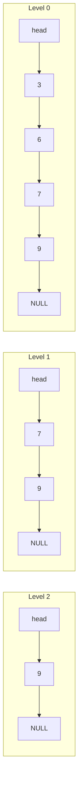
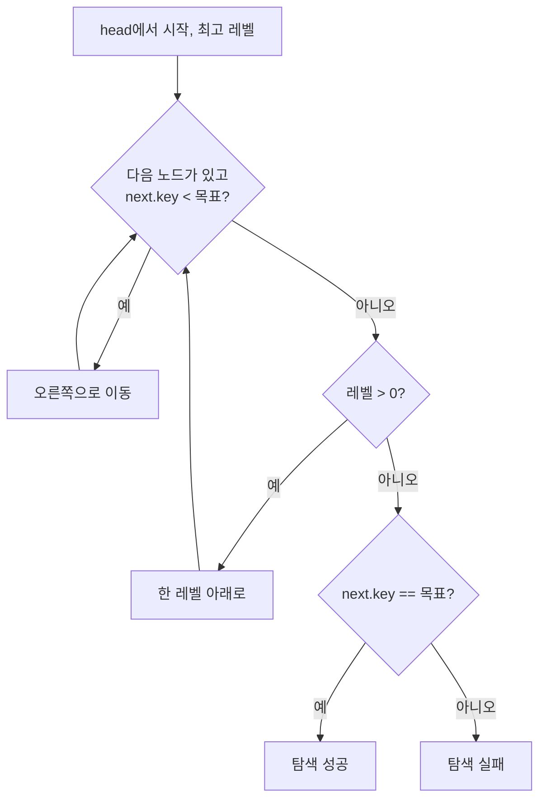
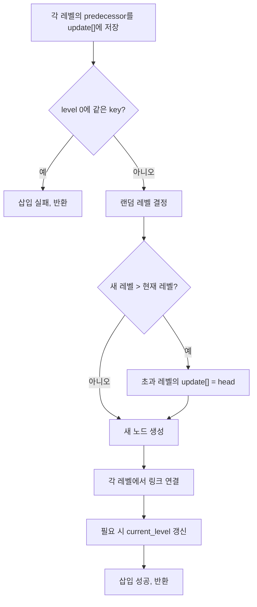
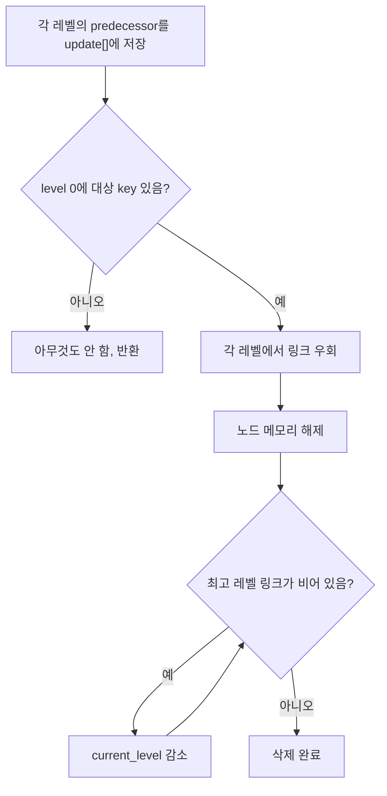

# Development Notes

이 문서는 SkipList 구현을 유지보수하거나 확장할 개발자를 위한 설명서입니다.

---

## 구현 요약

이 저장소는 두 가지 언어로 같은 SkipList를 구현합니다.

| 구현 | 핵심 구조 | 링크 표현 | 메모리 관리 |
| --- | --- | --- | --- |
| C | `struct skiplist_t`, `struct node_t` | `struct node_t **next` | `malloc/free` |
| C++ | `Skiplist`, `Node` | `std::vector<Node*> next` | `new/delete`, 복사 금지 |

---

## 메모리 구조

### 노드(Node) 레이아웃

하나의 노드는 `key` 하나와 레벨 수만큼의 `next` 포인터 배열을 가집니다.

**C 노드 (`struct node_t`)**

```
+-----------+
|    key    |  int (4 bytes)
+-----------+
|  next[0]  |  → level 0의 다음 노드
|  next[1]  |  → level 1의 다음 노드  (이 노드가 level 1 이상일 때만 존재)
|   ...     |
|  next[h]  |  → level h의 다음 노드  (h = 이 노드의 높이)
+-----------+
```

`next` 배열의 길이는 노드마다 다릅니다. 높이가 1인 노드는 `next[0]` 하나만, 높이가 3인 노드는 `next[0..2]` 세 개를 가집니다.

**C++ 노드 (`class Node`)**

```
+------------------+
|       key        |  int
+------------------+
|  next (vector)   |  std::vector<Node*>
|  [0] → ...       |
|  [1] → ...       |
|  ...             |
+------------------+
```

C++은 `std::vector`를 쓰므로 배열 크기가 런타임에 결정됩니다. 동작은 C와 동일합니다.

---

### 리스트(SkipList) 전체 구조

`head`는 항상 `max_level` 크기의 `next` 배열을 가지는 특별한 노드입니다. key는 없고 오직 각 레벨의 시작점 역할만 합니다.

예시: `3, 6, 7, 9`가 삽입된 상태 (7과 9가 상위 레벨에 올라간 경우)

```
         head      3        6        7        9
          |                          |        |
Level 2: [*]----------------------------→[9]→ NULL
          |                          |
Level 1: [*]--------------------→[7]→[9]→ NULL
          |        |        |    |        |
Level 0: [*]→[3]→[6]→[7]→[9]→ NULL
```

같은 노드(`7`, `9`)가 여러 레벨에서 동시에 연결되어 있습니다.
실제 메모리에는 노드가 하나씩만 존재하고, 각 레벨의 포인터가 그 노드를 가리키는 것입니다.

**Mermaid 다이어그램:**



---

## 핵심 규칙 (불변식)

코드를 수정할 때 반드시 지켜야 하는 규칙입니다.

1. **level 0에는 모든 key가 오름차순으로 있다.**
2. 상위 레벨도 항상 오름차순이다.
3. 노드가 level `k`에 있으면 level `0 ~ k-1` 전부에도 있다.
4. `head`의 `next` 배열 길이는 항상 `max_level`이다.
5. 사용하지 않는 상위 레벨의 `head.next`는 비어 있다(NULL).
6. 중복 key는 허용하지 않는다.

---

## 레벨 모델

코드 전체에서 레벨은 0부터 시작합니다(0-based).

| 항목 | 값 |
| --- | --- |
| 최소 노드 레벨 | `0` |
| 최대 노드 레벨 | `max_level - 1` |
| 노드의 `next` 배열 길이 | `노드 레벨 + 1` |
| 현재 최고 레벨 변수 | C: `level`, C++: `current_level` |

**랜덤 레벨 결정 방식:**

```text
level = 0
while random() < p and level < max_level - 1:
    level += 1
```

`p = 0.5`일 때 노드 분포 (기대치):
- level 0: 전체 노드
- level 1: 약 1/2
- level 2: 약 1/4
- level 3: 약 1/8

레벨이 높을수록 노드 수가 절반씩 줄어들어 `O(log n)` 탐색이 가능합니다.

---

## 탐색 알고리즘

가장 높은 레벨에서 시작해서, 다음 노드의 key가 목표보다 작으면 오른쪽으로 이동합니다. 더 이상 못 가면 한 레벨 내려갑니다. level 0까지 내려오면 결과를 확인합니다.



의사코드:

```text
current = head
for i from current_level down to 0:
    while current.next[i] != NULL and current.next[i].key < key:
        current = current.next[i]

candidate = current.next[0]
if candidate != NULL and candidate.key == key:
    return candidate
return NULL
```

---

## 삽입 알고리즘

탐색과 비슷하게 진행하면서, 각 레벨에서 새 노드가 들어갈 위치 바로 앞 노드를 `update[]` 배열에 저장합니다. 이후 이 배열을 이용해 링크를 끼워 넣습니다.



링크 연결 순서 (이 순서가 바뀌면 기존 뒷부분이 끊어집니다):

```text
new_node.next[i] = update[i].next[i]   ← 먼저 뒤를 연결
update[i].next[i] = new_node            ← 그다음 앞을 연결
```

---

## 삭제 알고리즘

삽입과 같은 방식으로 `update[]`를 채운 뒤, level 0에서 삭제 대상이 확인되면 각 레벨의 predecessor 링크를 대상 노드의 다음 노드로 바꿉니다.



링크 우회:

```text
for i from 0 to current_level:
    if update[i].next[i] != target:
        break
    update[i].next[i] = target.next[i]
```

삭제 후 최고 레벨의 `head.next`가 NULL이면 `current_level`을 하나씩 낮춥니다.

---

## 언어별 구현 메모

### C

- `create_node(key, level)`: `level + 1` 크기의 `next` 포인터 배열을 `malloc`으로 할당합니다.
- `skiplist_init(list, max_level, p)`: head를 `max_level` 크기로 생성합니다.
- `skiplist_destroy`: level 0을 따라 모든 노드를 `free`합니다.
- `skiplist_insert`: 중복 key면 `0`을 반환합니다.
- `skiplist_delete`: 없는 key면 조용히 반환합니다.

주의:
- 노드의 `next` 배열은 자신의 높이만큼만 할당됩니다. 자기 높이보다 높은 레벨에는 접근하면 안 됩니다.
- 삭제 시 `update[i].next[i] == target`인지 확인 후 갱신하므로 안전합니다.
- 레벨이 높아질 때 디버그 메시지가 출력됩니다.

### C++

- C 구현과 거의 같은 구조지만 포인터 대신 `std::vector<Node*>`를 사용합니다.
- `Skiplist` 소멸자에서 level 0을 따라 `delete`로 모든 노드를 해제합니다.
- 복사 생성자와 복사 대입 연산자를 `= delete`로 막아 double free를 방지합니다.
- 생성자 인자가 잘못되면 `std::invalid_argument`를 던집니다.

---

## 테스트 및 검증

**C:**

```bash
cd c
make run
make leak
```

**C++:**

```bash
cd cpp
make run
make leak
```

`make leak`은 `valgrind`가 설치된 경우 메모리 누수 검사를 실행합니다. 없으면 일반 실행으로 대체됩니다.

---

## 연산 복잡도

| 연산 | 평균 | 최악 |
| --- | --- | --- |
| 탐색 | `O(log n)` | `O(n)` |
| 삽입 | `O(log n)` | `O(n)` |
| 삭제 | `O(log n)` | `O(n)` |
| 공간 | `O(n)` | `O(n × max_level)` |

랜덤 레벨 분포가 균형 잡히면 평균 `O(log n)` 성능을 기대할 수 있습니다.

---

## 확장 아이디어

- key-value 저장 지원
- generic key 타입 지원
- iterator 추가
- C/C++ 단위 테스트 추가
- 랜덤 seed 주입 옵션 추가
- 출력 포맷 통일
